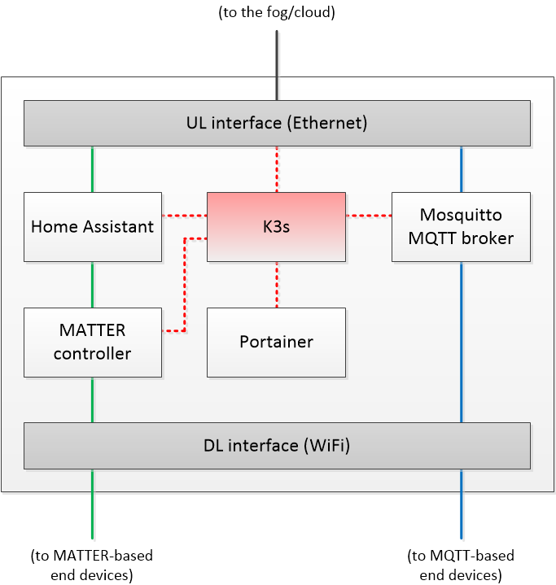

# IoT Edge Gateway
This manual includes all the steps and source code corresponding to the installation of the IoT Edge Gateway module of COGNIFOG into a Raspberry Pi module.

## A. Prerequisites
The IoT Edge Gateway has been validated in the following platform:
- **HW**: Raspberry Pi 4B (4GB RAM and 32GB SD card)
- **OS**: Debian GNU/Linux 11 (bullseye) and Debian GNU/Linux 12 (bookworm). These Linux-based OS distributions can be found in the Raspberry Pi Imager (https://www.raspberrypi.com/software/) under the name `Raspberry Pi OS Lite (64-bit)`. 
- **OS (2)**: Alternatively, if using the embedded version of **ARCA Trusted OS** (https://www.cysec.com/arca/), we refer the reader to https://github.com/cognifog-eu/iot-edge-gw/blob/main/ARCA_OS.md.
- **SW**: Lightweight Kubernetes K3S (https://k3s.io/)

(This manual has been created purposely for a Raspberry Pi with `cognifog` as hostname).

### A.1. Optional: Raspberry Pi permanently connected to an external WiFi network
After connected to a WiFi network (normally, if the network is created by a laptop in the so called softAP process), the Raspberry Pi may disconnect after a certain period of time (normally, after less than one hour). One possible cause of this malfunctioning is the Power Management feature of its wireless interface. A potential solution to alleviate this problem is to disconnect the Power Management mode. To do it, it is necessary to type the following commands in the Raspberry Pi terminal:
1. `sudo apt install wireless-tools`: It installs the wireless tools
2. `sudo iwconfig wlan0`: It checks the status of wlan0 interface
3. `sudo iwconfig wlan0 power off`: It disables the Power Management feature in wlan0 interface

To avoid having to execute this command after every Raspberry Pi power on, a script in the systemd file can be made to run a script on startup. The instructions are summarized in the following steps:
1.	Create a bash script file named `StartScript.sh` (or copy the one provided in the `/scripts` folder of this repository): 
`sudo nano StartScript.sh`
2.	Write the following content inside:
```
#!/bin/bash
sudo iwconfig wlan0 power off
```
3.	Make sure the script file is executable, using the following command: 
`sudo chmod a+x StartScript.sh`
4.	Create a new startup Systemd File within the `/etc/systemd/system` system file having the `.service` extension. For instance, `/etc/systemd/system/ScriptService.service` file is created using the following command in the nano editor:
`sudo nano /etc/systemd/system/ScriptService.service`
5.	Write the below content to run the bash script `StartScript.sh` on startup:
```
[Unit]
Description=Custom Startup Script
 
[Service]
ExecStart=/home/ubuntu/StartScript.sh  # USE HERE YOUR OWN FOLDER
 
[Install]
WantedBy=default.target
```

- **Unit**: It stores the metadata and other information you want to store related to the script.
- **Service**: Tells the system to execute the desired service, which will run on startup.
- **Install**: Allows the service to run the WantedBy directory at the startup to handle the dependencies.

6.	Set the user executable file permissions using the following command:
`sudo chmod 644 /etc/systemd/system/ScriptService.service`
7.	Use the below-stated command to enable the customized service (which allows the execution on each startup):
`sudo systemctl enable ScriptService.service`

From now on, every time the system starts/reboots, the script file will execute automatically.

(Further information on the **A.1. Optional: WiFi permanent connection** step can be found in **Method 1** section of the following link: https://itslinuxfoss.com/run-script-startup-ubuntu/)

### A.2. Optional: Raspberry Pi acting as a WiFi Access Point at 2.4 GHz
**This setup requires a Raspberry Pi using Debian GNU/Linux 12 (bookworm) and Network Manager as system network service.**

**This setup also requires that the Raspberry Pi's WiFi interface is not used for Internet access. Instead, the Raspberry Pi should be connected to the Internet via its Ethernet interface.**

The instructions to turn the Raspberry Pi into a WiFi Access Point at 2.4 GHz are summarized in the following steps:

1. The first thing to do is to update and upgrade your Raspberry:
```
sudo apt update
sudo apt upgrade
```

2. If you are using a fresh new Raspberry Pi OS, you might need to set a Wi-Fi country first. Open raspi-config with this command:

`sudo raspi-config`

3. Then, go to “Localisation Options” > “WLAN country” and select your country from the list. Confirm and exit. From there on, the Wi-Fi interface will be enabled.

4. Start by enabling the WiFi interface in Network Manager with:

`sudo nmcli device wifi hotspot ifname wlan0 band bg ssid cognifog_wifi password <password>`

By default, `cognifog_wifi` is the SSID of the resulting WiFi network, but it can be changed by any other SSID name.
The last parameter (i.e., `<password>`) corresponds to the WiFi WPA2-based password.

5. Next, configure Network Manager to run in access point mode, with shared IP addresses on this interface:

`sudo nmcli con modify Hotspot connection.autoconnect yes 802-11-wireless.mode ap 802-11-wireless.band bg ipv4.method shared ipv4.address 192.168.6.1/24`

The last parameter corresponds to the IP (i.e., 192.168.6.1) of the Raspberry Pi within the created network and the network mask (i.e., /24). 

6. Lastly, it is necessary to turn down and then turn up the Hotspot to apply the configuration:
```
sudo nmcli con down Hotspot
sudo nmcli con up Hotspot
```

Once the Raspberry Pi is configured as an AP, *nmtui* tool can also be used to edit the main settings, like upgrading the security, for example. In there, you can see and edit your configuration easily, without having to find all the commands parameters. Here is the command to open this tool:

`sudo nmtui`

If you experience any issue, you can check the state of the connections with:

`sudo nmcli con show`

Alternatively, you can check the logs with:

`journalctl`

You can use grep to filter the output:
```
journalctl | grep hotspot
journalctl | grep wifi
```

Lastly, it is possible to list the connected devices to the WiFi Access Point by executing:

`sudo arp | sort` and looking for those IP addresses connected to the wlan0 interface.

(Further information on the **A.2. Optional: Configuring a Raspberry Pi as a WiFi Access Point** step can be found in the following links: https://raspberrytips.com/access-point-setup-raspberry-pi/ and https://www.baeldung.com/linux/nmcli-wap-sharing-internet)

(For more advanced tools to list the connected devices on a WiFi Access Point, check https://www.baeldung.com/linux/list-devices-wireless-access-point)

## B. K3S installation
The following commands need to be executed to install K3S in the Raspberry Pi and create a cluster with a single node (i.e., the Raspberry Pi itself):

1. The first thing to do is to update and upgrade the Raspberry Pi:
```
sudo apt update
sudo apt upgrade
```

2. Then, in file `/boot/cmdline.txt` add `cgroup_enable=cpuset cgroup_enable=memory cgroup_memory=1` to the end of the existing line (do not add it as a new line!!) and reboot the Raspberry Pi:
```
sudo nano /boot/cmdline.txt
(modify cmdline.txt file and save the changes as mentioned before)
sudo reboot
```

3. The next step installs K3S:
`curl -sfL https://get.k3s.io | sh -s - --write-kubeconfig-mode 644`

And that’s it! You have a Kubernetes cluster running! You can check it with the command:
`kubectl get pods -A`

(A comprehensive description of **B. K3S installation** step can be found at https://www.padok.fr/en/blog/raspberry-kubernetes. In addition, here is the official rancher documentation to install k3s: https://docs.k3s.io/quick-start)

## C. IoT Edge Gateway toolkit installation
The IoT Edge Gateway can be populated with a toolkit of open-source applications, which can be deployed via K3S either locally or remotely. 

| Purpose                                      | Toolkit application(s)                                     |
|----------------------------------------------|------------------------------------------------------------|
| Communication with MATTER-based end devices  | - Home Assistant                                          |
|                                              | - MATTER controller add-on for Home Assistant              |
| Communication with MQTT-based end devices    | - Mosquitto MQTT broker (alternatively, Home Assistant can also work with a Mosquitto MQTT broker add-on)                                   |
| Container management                         | - Portainer                                               |
| Network performance testing                  | - iPerf3                                                  |

The deployment files (.yaml manifests) of the different applications are available in the `/manifests` folder of this repository:
- **Home Assistant**: Open-source home automation platform that allows users to control and manage various smart devices and services (https://www.home-assistant.io/)
  - `home-assistant-deploy.yaml`: Home Assistant deployment file (`2024.9.1` release, validated at 10/09/2024)
  - `home-assistant-service.yaml`: Home Assistant service file
- **MATTER controller add-on for Home Assistant**: Plug-in for Home Assistant to control MATTER-based end devices running over WiFi (https://www.home-assistant.io/integrations/matter/)
  - `matter-server-deploy.yaml`: Matter Server deployment file (`6.5.0` release, validated at 10/09/2024)
  - `matter-server-service.yaml`: Matter Server service file
- **Mosquitto MQTT broker**: Open-source message broker that implements the MQTT protocol (https://mosquitto.org/). 
  - It can be installed in the Raspberry Pi by following the steps from https://github.com/cognifog-eu/mqtt-broker.
- **Portainer**: Open-source management and user interface for Docker/Kubernetes (https://www.portainer.io/)
  - `portainer-deploy-full.yaml`: Portainer deployment file (all included)
- **iPerf3**: iPerf3 is an open-source tool for active measurements of the maximum achievable bandwidth on IP networks. It supports tuning of various parameters related to timing, buffers and protocols (TCP, UDP, SCTP with IPv4 and IPv6). For each test it reports the bandwidth, loss, and other parameters (https://iperf.fr/).  
  To utilize iPerf3, it must be installed on two machines: one serving as a server and the other as a client. In the COGNIFOG project, we recommend deploying an Edge Server to function as the iPerf3 server and a Raspberry Pi to serve as the iPerf3 client. However, once iPerf3 is installed on any machine, it can be configured either as a server or as a client, offering flexibility in its deployment and use.  
  - **iPerf3 server**: To be installed in an Edge server with an x86-64 architecture:
    - `iperf3-server-deploy.yaml`: iPerf3 server deployment file
    - `iperf3-server-service.yaml`: iPerf3 server service file
  - **iPerf3 client**: To be installed in a Raspberry Pi with an ARM64 architecture:
    - `iperf3-client-deploy.yaml`: iPerf3 client deployment file
    - `iperf3-client-service.yaml`: iPerf3 client service file

To install an application locally, copy all its files from the corresponding `/manifests` folder of this repository into a folder of the Raspberry Pi and run the following K3S command: `kubectl apply -f .` Alternatively, each application file can be deployed by using the following K3S command: `kubectl apply -f [file].yaml`

For a remote deployment of applications, see **E. Integration with OCM**.

Check that services are properly deployed by running:
`kubectl get pods -A`

The next figure illustrates the internal architecture of the IoT Edge GW with all the applications deployed from the toolkit. The connections between elements are color-coded: red indicates the deployment and management of applications via K3s, green signifies data transmission to and from MATTER-based end devices, and blue represents data transmission to and from MQTT-based end devices.



### C.1. Considerations on the installation of Home Assistant and the Matter controller add-on
By default, the deployment files of the **Home Assistant** (i.e., `home-assistant-deploy.yaml`) and the **Matter controller add-on** (i.e., `matter-server-deploy.yaml`) require the existence of some folders in the Raspberry Pi to store the corresponding configuration files:
  - Home Assistant: `/home/cognifog/iot-edge-gw/ha-config`
  - Matter controller add-on: `/home/cognifog/iot-edge-gw/matter-server-config`

The creation of these folders can be automatized by executing the script `CreateFolders.sh`, included in the `/scripts` folder of this repository. Just copy the `CreateFolders.sh` file into the Raspberry Pi and execute `bash CreateFolders.sh`. Alternatively, the user can create different folders as long as they match the definition of the previous deployment files.

**Note:** The installation of **Home Assistant (2024.9.1)** and the **Matter controller add-on (6.5.0)** can be notably slow due to the size of both images: 593 MB (plus 69.7 MB of the Bluetooth service) and 167 MB, respectively. To mitigate this, it is advisable to connect the Raspberry Pi to the Internet by means of its Ethernet interface for faster download speeds.

**Important:** The inclusion of memory limits in the manifest files of these containers may result in deployment failures. The default memory settings are as follows:
```
resources:
  requests:
    memory: "256Mi"
  limits:
    memory: "512Mi"
```

## D. IoT Edge Gateway toolkit configuration
### D.1. Home Assistant
After a successful installation, Home Assistant should be running at `http://[IP_ADDRESS]:8123`. After accessing that URL with a browser, it is highly recommended to follow the onboarding process according to the official Home Assistant website (https://www.home-assistant.io/getting-started/onboarding/). Alternatively, we highly recommend to follow the guide to load a preconfiguration of Home Assistant, the Matter controller and the MQTT client at https://github.com/cognifog-eu/iot-edge-gw/tree/main/ha-config.

From this point on, **D.2.** and **D.3.** subsections describe how to manually configure both the Matter controller and the MQTT client for Home Assistant. 

### D.2. Matter controller add-on for Home Assistant
It may be necessary to configure the Matter controller add-on from the GUI of Home Assistant. To do this, follow these steps:
1. Go to Settings -> Devices & services
2. Click Add Integration
3. Type 'Matter' into the field 'Search for a brand name'
4. Click 'Matter (BETA)'
5. Check that the URL* field contains `ws://localhost:5580/ws`
6. Click 'Submit'

### D.3. MQTT client for Home Assistant
Unfortunately, at 23/04/2024, the MQTT client for Home Assistant can only be configured by using the GUI of Home Assistant (https://community.home-assistant.io/t/automate-mqtt-broker-integration-set-up/607558/4). To do it, follow these steps:
1. Go to Settings -> Devices & services
2. Click Add Integration
3. Type 'MQTT' into the field 'Search for a brand name'
4. Click 'MQTT'
5. Fill the requested fields: i.e., broker, port, username, and password

### D.4. Mosquitto MQTT broker
The configuration of the Mosquitto MQTT broker is described in https://github.com/cognifog-eu/mqtt-broker. 

### D.5. Portainer
Once installed, the Portainer instance will be deployed into your local cluster in a few moments. Navigate to `http://[IP_ADDRESS]:30777` and you will see the home page where we need to set a new password. Add this and hit next.

The following message may appear if Portainer is not configured just after its deployment: `Your Portainer instance timed out for security purposes. To re-enable your Portainer instance, you will need to restart Portainer.` In that case, it will be necessary to restart the Portainer deployment by typing: `kubectl rollout restart deployment portainer -n portainer`.

### D.6. iPerf3
Once iPerf3 is installed in two different nodes (one acting as a server and the other as a client), it is necessary to get a shell to the pod running iPerf3 in each case by running the following command:
`kubectl exec -it <pod_name> -n <iperf3-server / iperf3-client> -- sh`, where `<pod_name>` corresponds to the name of the pod.

Once inside the corresponding pods, run the following commands in each case for a basic example:
  - **iPerf3 server**:
    - `iperf3 -s`: It configures the iPerf3 instance as a server
  - **iPerf3 client**: 
    - `iperf3 -c <server-pod-IP>`: It configures the iPerf3 instance as a client and starts the communication with the corresponding IP address of the server; i.e., `<server-pod-IP>`

(Further informartion on the iPerf3 commands can be found in https://iperf.fr/iperf-doc.php)

## E. Integration with OCM
An external OCM Manager node can be used as an Orchestrator of the deployed IoT Edge Gateway(s). To connect the IoT Edge Gateway(s) to that system it is necessary to follow these steps:
1. Install `clusteradm`, which is the tool used for managing OCM Clusters (Managers and Agents; in this case: Agent). This tool may be installed inside of the Raspberry Pi where K3S is running locally or, alternatively, in another machine (e.g., a laptop) and manage the cluster remotely. In any case, the command to install OCM `clusteradm` is: 
`curl -L https://raw.githubusercontent.com/open-cluster-management-io/clusteradm/main/install.sh | bash`
2. Only if the installation has been performed in a Raspberry Pi, it is necessary to execute the following command to finish the installation of OCM: `cp /etc/rancher/k3s/k3s.yaml .kube/config`
3. Then, the command for a managed cluster to join the hub is: `clusteradm join --hub-token <token> --hub-apiserver <api server url> --wait --cluster-name <cluster name> --ca-file=<server certificate .crt file>` (or a similar one provided by the hub administrator)
4. In case the hub administrator requires a server certificate file (.crt), it must be included in the same folder where the previous command is executed (i.e., that from step #3). Further information on how to register a cluster can be found here: https://open-cluster-management.io/getting-started/installation/register-a-cluster/

## F. MATTER-based end devices
A first validation of the **Home Assistant** and the **Matter controller add-on** services into the IoT Edge Gateway has been performed in combination with a set of MATTER-based ESP32-S2 devices. The firmware employed in those devices has been Tasmota (https://tasmota.github.io/docs/). More information on this setting can be found in https://github.com/cognifog-eu/iot-edge-gw/tree/main/tasmota.