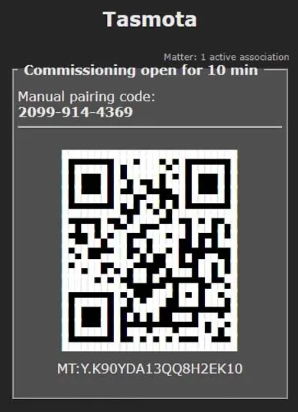

# Configuration of MATTER-based devices via Tasmota
End devices can be configured to interact with the IoT Edge Gateway by means of the MATTER protocol. More specifically, this communication has been validated by using ESP32-S2 DevKitM-1 devices (https://docs.espressif.com/projects/esp-idf/en/latest/esp32s2/hw-reference/esp32s2/user-guide-devkitm-1-v1.html) and the firmware provided by Tasmota (https://tasmota.github.io/docs/).

A Tasmota pre-configured file with the configuration of Tasmota 13.3.0 for an ESP32-S2 DevKitM-1 device is provided in this folder. To flash an ESP32-S2 device with this firmware, connect the ESP32-S2 to a laptop via USB and visit its web installer: https://tasmota.github.io/install/. Then, follow these steps:
1. Click 'CONNECT' and select the COM port to which the device is connected
2. Press 'INSTALL TASMOTA (ENGLISH)' (the device's memory will be erased to install the new firmware)
3. Once the installation is finished, configure the WiFi network appropiately
4. Then navigate with the browser to the IP allocated to the ESP32-S2 and click 'Configuration -> Restore Configuration'
5. Use the file provided in this folder with the format `Config_tasmota_<version>.dmp` and click 'Start restore'. Please note that WiFi connections are also preconfigured in the configuration file. In consequence, Tasmota configuration can only be modified by accessing its IP address in the corresponding WiFi network 
6. Once the restoration is completed, change the Friendly Name of the device. To do it, go to 'Configuration -> Configure Other' and change the Friendly Name to `Tasmota<X>`, being `<X>` a unique value between `1` and `10`
7. Since the pre-configured file includes the compatibility with MATTER, a 10-minute window is automatically opened to perform the commissioning process with a MATTER controller. Go to the 'Main Menu' and scan the QR code with the 'Home Assistant mobile app' installed in a mobile device. **To complete the commissioning process successfully, all three elements (i.e., the MATTER-based device, the IoT Edge GW, and the phone running the mobile app) must be in the same network.**
  - Android: https://play.google.com/store/apps/details?id=io.homeassistant.companion.android
  - iOS: https://apps.apple.com/us/app/home-assistant/id1099568401

8. If successful, the 'Home Assistant mobile app' should display a message similar to 'Commissioning complete'

## A. Config_tasmota_069412_5138_13.3.0.dmp
Minimal configuration of an ESP32-S2 for Tasmota 13.3.0, created at 04/01/2024 with the following features:
- Device Name (*Model* field in Home Assistant menu): `ESP32`
- Friendly Name (*Device* field in Home Assistant menu): `Tasmota1` (please change the name to `Tasmota<X>` as previously mentioned)
- Wifi connectivity based on 1 preconfigured network:
  - SSID: `iot_responda`
  - Password: `<protected>`
- Sensors:
  - 1 RGB led sensor (WS2812) in GPIO18
  - 1 Temperature + humidity sensor (DHT22; mapped in Tasmota as AM2301) in GPIO17
- Teleperiod (i.e., sensor data update rate) in seconds: `30`
- Matter compatibility with 3 predefined endpoints (see attached table)  

| Endpoint   | Type            | Parameter            |
|------------|-----------------|----------------------|
|     1      | Light 3 RGB     | *_Not used_*         |
|     2      | Temperature     | AM2301#Temperature   |
|     3      | Humidity        | AM2301#Humidity      |

## B. Config_tasmota_069412_5138_13.3.0_v2.dmp
Same configuration as in `A. Config_tasmota_069412_5138_13.3.0.dmp`, but created at 06/02/2024 with an additional network:
- Wifi connectivity based on 2 preconfigured networks:
  - SSID_1: `iot_responda`
  - Password: `<protected>`
  - SSID_2: `cognifog_wifi`
  - Password: `<protected>`